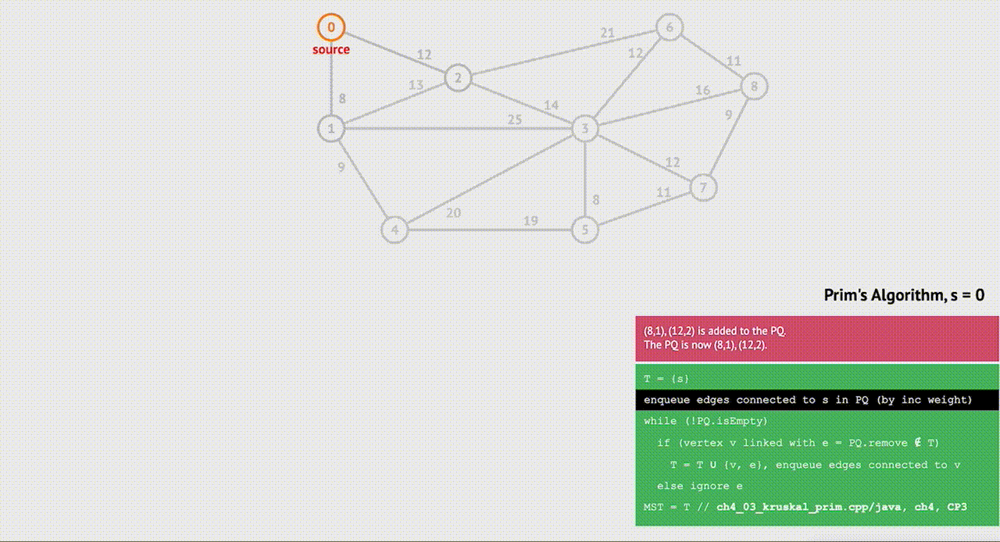
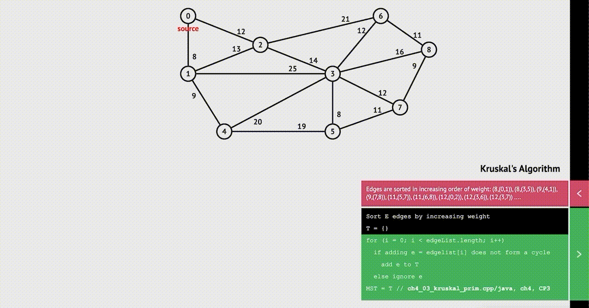

# Binary Search Algorithm 
Binary Search is a searching algorithm for finding an element's position in a sorted array. In this approach, the element is always searched in the middle of a portion of an array.

Binary Search Algorithm can be implemented in two ways which are discussed below.

* Iterative Method
* Recursive Method (Divide and Conquer)

## Iterative approach 


```
do until the pointers low and high meet each other.
    mid = (low + high)/2
    if (x == arr[mid])
        return mid
    else if (x > arr[mid]) // x is on the right side
        low = mid + 1
    else                       // x is on the left side
        high = mid - 1
```

## Recursive Approach 

```
binarySearch(arr, x, low, high)
    if low > high
        return False 
    else
        mid = (low + high) / 2 
        if x == arr[mid]
            return mid
        else if x > arr[mid]        // x is on the right side
            return binarySearch(arr, x, mid + 1, high)
        else                               // x is on the right side
            return binarySearch(arr, x, low, mid - 1)
```

# Minimum Spanning Tree

A minimum spanning tree is a special kind of tree that minimizes the lengths (or “weights”) of the edges of the tree.
The minimum spanning tree from a graph is found using the following algorithms:
* Prim's Algorithm 
* Kruskal's Algorithm 

## Prim's Algorithm 
Prim's algorithm is a minimum spanning tree algorithm that takes a graph as input and finds the subset of the edges of that graph which 
- form a tree that includes every vertex 
- has the minimum sum of weights among all the trees that can be formed from the graph

 

### Pseudo code for Prim's Algorithm 
```
T = ∅;
U = { 1 };
while (U ≠ V)
    let (u, v) be the lowest cost edge such that u ∈ U and v ∈ V - U;
    T = T ∪ {(u, v)}
    U = U ∪ {v}
```


## Kruskal's Algorithm 

Kruskal's algorithm is a minimum spanning tree algorithm that takes a graph as input and finds the subset of the edges of that graph which 
- form a tree that includes every vertex 
- has the minimum sum of weights among all the trees that can be formed from the graph

 

### Pseudo code for Kruskal's Algorithm 

```
KRUSKAL(G):
A = ∅
For each vertex v ∈ G.V:
    MAKE-SET(v)
For each edge (u, v) ∈ G.E ordered by increasing order by weight(u, v):
    if FIND-SET(u) ≠ FIND-SET(v):       
    A = A ∪ {(u, v)}
    UNION(u, v)
return A
```

# Knapsack Problem 
It is an optimization technique that we can use to solve problems where the same work is being repeated over and over. A problem can be optimized using dynamic programming if it:

* Optimal substructure: 
Optimal substructure simply means that you can find the optimal solution to a problem by considering the optimal solution to its subproblems.
* Overlapping subproblems:
having overlapping subproblems means we are computing the same problem more than once. 


```
//this function behaves like the V(i,c) method defined previously
//in this chapter
int V(int i, int c){
    //base cases
    if(i == 0 || c == 0){
        return 0;
    }
    //item does not fit case
    if(wt(i) > c){
        return V(i-1, c);
    }
    //compare best case if item i is taken or left behind.
    //and return the larger number.
    int B = V(i-1, c-wt(i)) + value(i);
    int A = V(i-1, c);
    if(A >= B){
        return A;
    }
    else{
        return B;
    }
}
```


# Heaps (heap sort)

# Travelling Salesman Problem

# A*
